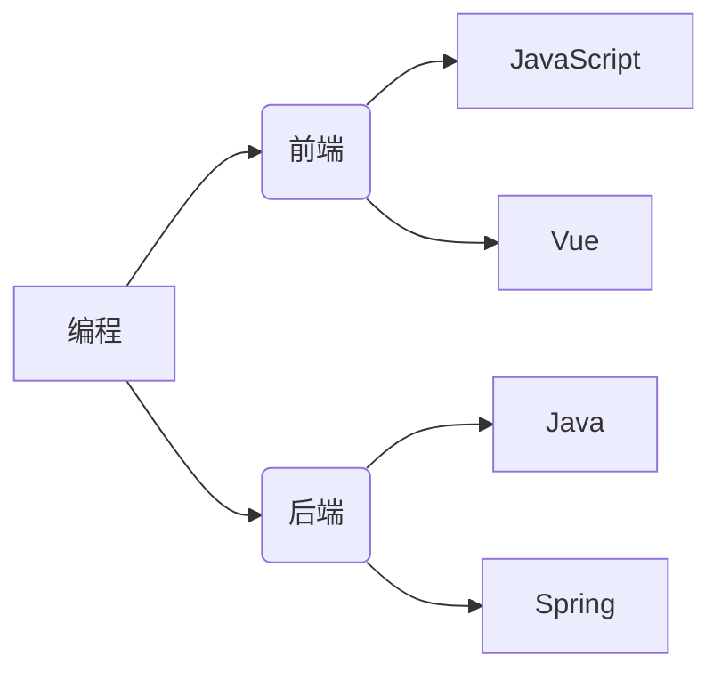

# 🚀 技术探险日志


---


> 记录代码世界的发现与思考 | [订阅 RSS](rss.xml)

---

## 📚 最新文章
| 日期       | 标题                          | 分类       |
|------------|-------------------------------|------------|
| 2024-08-15 | [React Server Component 实践陷阱](/posts/react-sc.md) | Web 开发 |
| 2024-08-02 | [用 Go 实现分布式任务调度器](/posts/golang-scheduler.md) | 后端架构 |
| 2024-07-20 | [CSS Container Queries 设计响应式布局](/posts/css-cq.md) | 前端技术 |
| 2024-08-01 | [Java核心基础卷I](https://github.com/QuasarMind-byte/technical-logs/tree/main/Java-notes) | 后端开发 |
| 2024-08-01 | [Web开发](https://github.com/QuasarMind-byte/technical-logs/tree/main/web-notes) | Web开发 |

## 🛠️ 项目展示
```java
# 示例代码片段
public class Hello {
  public static void main(String[] args) {
    System.out.println("Hello,World！");
  }
}
```
- **[PyAnalyzer](https://github.com/你/项目名)**：Python 静态代码分析工具  
- **[NextJS-Boilerplate](https://github.com/你/项目名)**：现代 Web 应用脚手架  

## 🌐 关于我

- **技术栈**：JavaScript · TypeScript · Java · HTML/CSS  
- **联系**： [Twitter](https://twitter.com/你) | [个人网站](https://你的域名) 

> **名言**：*“代码是写给人看的，只是顺便让机器能运行”*  
